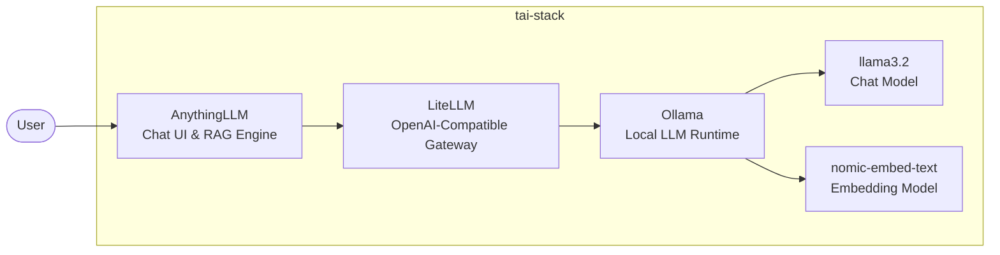

# tai-stack — tiny ai stack

A fully local, privacy-first AI stack that runs on a single machine (no GPU required). No cloud APIs. No subscriptions. Your data never leaves your hardware.

Built as an educational project to explore what it takes to assemble a production-shaped AI stack — chat interface, API gateway, and inference engine — using entirely open-source components.

---

## Architecture



The stack is deliberately layered. `AnythingLLM` handles user interaction and document retrieval (RAG), but it doesn't talk to `Ollama` directly — it goes through `LiteLLM`, which exposes an OpenAI-compatible API. This decouples the UI from the inference backend, so models can be swapped or extended in `litellm/config.yaml` without touching anything else. `Ollama` sits at the bottom running inference entirely on local hardware.

---

## Components

| Component | Role | Explanation |
|---|---|---|
| [Ollama](https://ollama.com) | Local LLM inference engine | Simple model management, broad model library, runs on CPU or GPU |
| [LiteLLM](https://github.com/BerriAI/litellm) | OpenAI-compatible API gateway | Normalizes requests across backends; lets AnythingLLM stay model-agnostic |
| [AnythingLLM](https://github.com/Mintplex-Labs/anything-llm) | Chat UI and RAG platform | Full-featured out of the box: workspaces, document ingestion, embedding pipeline |

### Models

- **llama3.2** — default chat model, good balance of capability and resource usage
- **nomic-embed-text** — embedding model used by AnythingLLM's RAG pipeline to convert documents into vector representations for semantic search

### Known quirks

There is a bug in the LiteLLM → Ollama pipeline where tool calls are returned as raw JSON text rather than structured `tool_calls` fields. This stack works around it by setting `PROVIDER_DISABLE_NATIVE_TOOL_CALLING=litellm` in AnythingLLM's environment, which forces the tool-calling logic to be handled at the application layer instead.

---

## Prerequisites

- [Docker](https://docs.docker.com/get-docker/) with the Compose plugin
- **8 GB RAM minimum** (llama3.2 requires ~4 GB; more headroom is better)
- An internet connection on first run to pull images and models

---

## Quick Start

```bash
git clone https://github.com/richard3d/tai-stack.git
cd tai-stack
docker compose up
```

On first run, the `ollama-init` service automatically pulls `llama3.2` and `nomic-embed-text`. This takes a few minutes depending on your connection.

Once all services are healthy, open `http://localhost:3001` to access AnythingLLM.

---

## Configuration

### Adding models

Edit `litellm/config.yaml` to register additional Ollama models:

```yaml
model_list:
  - model_name: llama3.2
    litellm_params:
      model: ollama/llama3.2
      api_base: http://ollama:11434
      supports_function_calling: true

  - model_name: mistral
    litellm_params:
      model: ollama/mistral
      api_base: http://ollama:11434
```

Then update `ollama-init` in `docker-compose.yaml` to pull the new model on startup:

```yaml
entrypoint: ["/bin/sh", "-c", "ollama pull llama3.2 && ollama pull mistral && ollama pull nomic-embed-text"]
```

### GPU acceleration (Linux + Nvidia only)

Uncomment the `deploy` block in the `ollama` service in `docker-compose.yaml`. Requires the [NVIDIA Container Toolkit](https://docs.nvidia.com/datacenter/cloud-native/container-toolkit/install-guide.html).

> **Note:** Docker on Apple Silicon cannot access the GPU. The stack runs on CPU on macOS.

---

## Service Endpoints

| Service | URL | Notes |
|---|---|---|
| AnythingLLM | http://localhost:3001 | Main chat interface |
| LiteLLM | http://localhost:4000 | OpenAI-compatible API (`Authorization: Bearer sk-local`) |
| Ollama | http://localhost:11434 | Raw inference API |